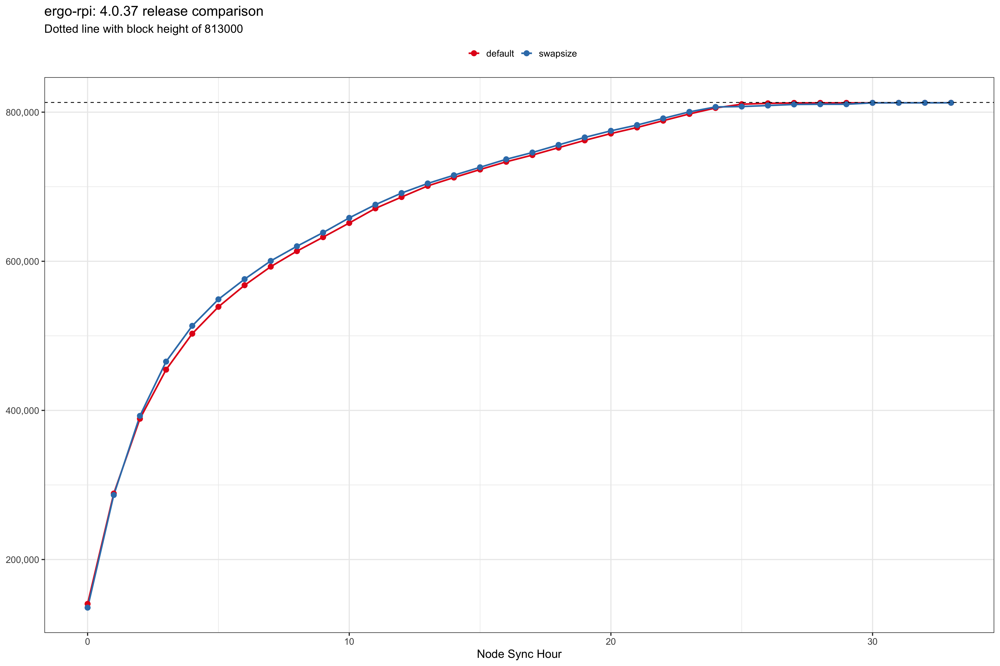

# Releases

## Hardware setup

* Raspberry Pi 4 with 4gb RAM
* RPi OS Lite (64-bit)
* 256gb MicroSD
* Ethernet connection

## 4.0.37

```
Date: 2022-08-08
Time: 13:04:06 PST
Block Height: 811249
```

| Config | Node Sync | GB usage |
| --- | --- | --- | 
| default | 26h | 20.9 |
| swapsize | 29h | 21.1 | 

Full node sync for this version completed in 26 hours with default settings which is a significant improvement to v4.0.35 of [46 hours](https://github.com/Eeysirhc/ergo-rpi-node-logs/tree/main/releases#4035).



## 4.0.35 

| Unit | MicroSD | SWAP config | Crashes | Headers | Node | Wallet | Total | 
| --- | --- | --- | --- | --- | --- | --- | --- | 
| RPi4-4gb | 256gb | - | 2 | 2.25h | 46h | 13h | 2.6 days | 


## 4.0.27
| Unit | MicroSD | SWAP config | Crashes | Headers | Node | Wallet | Total | 
| --- | --- | --- | --- | --- | --- | --- | --- | 
| RPi4-4gb | 256gb | yes | - | 1h | 30h | 5h | 1.5 days | 
| RPi4-4gb | 32gb | yes | 4 | 3h | 90h | 15h | 4.5 days | 

