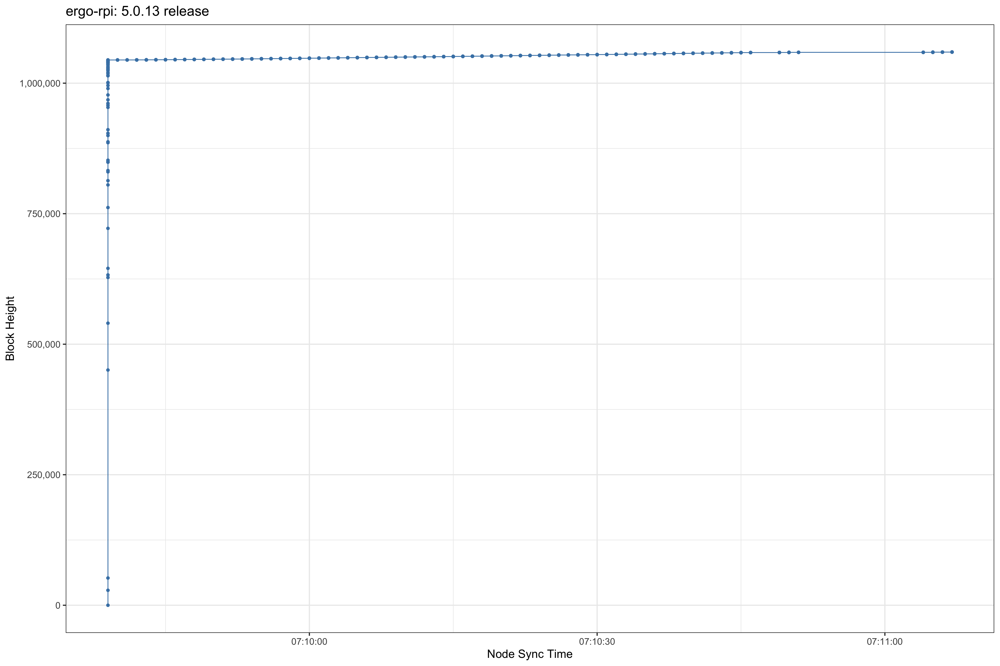
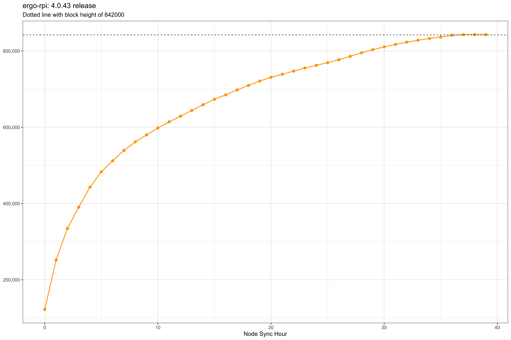

# Releases

### Hardware setup

* Raspberry Pi 4 with 4gb RAM
* RPi OS Lite (64-bit)
* 256gb MicroSD
* Ethernet connection

## 5.0.13

Full NiPoPow node sync completed in 2.5 minutes with default settings - a dramatic improvement compared to one year ago.



### Metadata
```
Start Date: 2023-08-01
Start Time: 07:09:31 PST
Start Height: 1,059,660
```

| Config | Duration | Memory | 
| --- | --- | --- | 
| default | 2.5 mins | 0.30 GB | 

## 4.0.43

Full node sync completed in 36 hours with default settings which is an increase from the last comparison of 4.0.37 at 26 hours.



### Metadata
```
Start Date: 2022-09-18
Start Time: 02:12:57 PST
Start Height: 842339
```

| Config | Duration | Memory | 
| --- | --- | --- | 
| default | 36 hrs | 25 GB | 

## 4.0.37

Full node sync for this version completed in 26 hours with default settings which is a significant improvement to v4.0.35 of 46 hours.


### Metadata
```
Start Date: 2022-08-08
Start Time: 13:04:06 PST
Start Height: 811249
```

| Config | Duration | Memory |
| --- | --- | --- | 
| default | 26 hrs | 20.9 GB |
| swapsize | 29 hrs | 21.1 GB | 

## 4.0.35 

| Unit | MicroSD | SWAP config | Crashes | Headers | Node | Wallet | Total | 
| --- | --- | --- | --- | --- | --- | --- | --- | 
| RPi4-4gb | 256gb | - | 2 | 2.25h | 46h | 13h | 2.6 days | 

## 4.0.27
| Unit | MicroSD | SWAP config | Crashes | Headers | Node | Wallet | Total | 
| --- | --- | --- | --- | --- | --- | --- | --- | 
| RPi4-4gb | 256gb | yes | - | 1h | 30h | 5h | 1.5 days | 
| RPi4-4gb | 32gb | yes | 4 | 3h | 90h | 15h | 4.5 days | 


